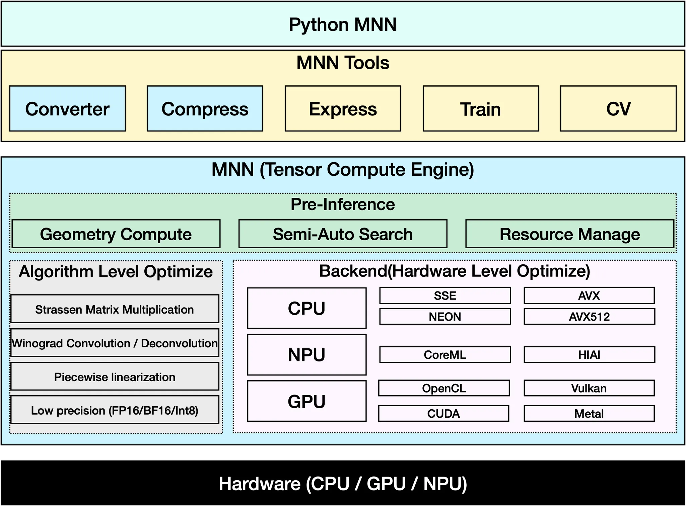
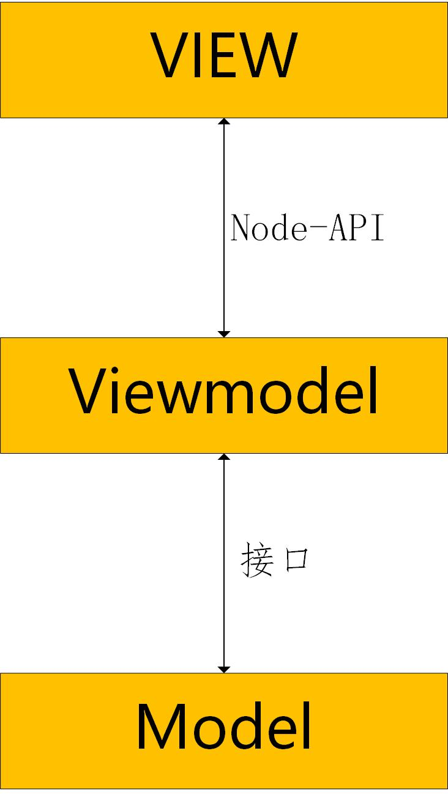

# 基于OpenHarmony操作系统，构建离线多模态大模型APP

[toc]
## 队伍介绍
　　2025 年全国大学生计算机系统能力大赛操作系统设计赛——功能赛道
　　赛题：project88——基于OpenHarmony操作系统，构建离线多模态大模型APP
　　队伍：炸薯丸
　　队员姓名： 王子宁、查贝斯、索子骁
　　指导老师： 李永坤、徐伟
　　学校名称：中国科学技术大学

## 目标描述

项目的基本目标是在装有 `OpenHarmonyOS` 的 `DAYU200` 开发板上开发一款端侧推理的大模型软件，实现了端侧部署推理基础的LLM模型，能够稳定理解输入文本并输出文本数据。本项目实现的大模型处理框架处于系统层与应用层之间，可以为泛用软件提供端侧推理部署接口，实现端侧推理模块化。

**目标一（已完成）**：在开发板安装Open HarmonyOS，能够正常运行测试开发软件

**目标二（已完成）**：开发一款基于鸿蒙生态的智能聊天软件的应用界面

**目标三（已完成）**：移植第三方库，在开发板上编译运行大语言模型，实现LLM的端侧推理部署

**目标四（已完成）**：将大语言模型推理与软件整合，实现推理结果输出展示

**目标五（未完成）**：移植库并优化，实现多模态大模型的端侧推理部署

**目标六（未完成）**：将模型处理接口对接整合鸿蒙操作系统，实现操作系统级的大模型端侧推理能力

## 项目特点
- **ArkUI + ArkTS 现代前端开发**  
  前端界面基于 ArkUI 框架，使用 ArkTS（TypeScript）语言开发。具备声明式 UI、响应式数据绑定、组件化开发等现代特性，界面美观且易于维护。![[app-look.png]]
- **原生 C++  层处理大模型推理**
	使用 native C++ 中 napi 与应用层 ArkTS 互联实现高效的大模型推理，同时通过 C++ 层接入核心第三方库，加速推理过程。

## 主要技术栈
- **前端**：ArkUI、ArkTS
- **中间层** ：多线程驱动
- **后端/驱动**：C++（NAPI 模块）

## 赛题分析与调研
本项目的核心在于利用有限的开发板硬件资源部署端侧的（多模态）大模型，在此基础上开发一款多模态大模型应用。项目主要需要解决的问题是：
- [x] 模型与Open HarmonyOS的适配与嵌入
- [x] 移植需要的库函数支持本地化大模型推理
- [ ] 优化模型处理（包括模型量化，使用OpenGL库等），使开发板能够运行多模态大模型
- [x] 支持系统级的大模型推理能力，增强模型的泛用性

随后，我们针对这几项问题进行了深入的调研和尝试。
首先，我们查看了开发板编译烧录相关内容，调查了如何自定义定制Open HarmonyOS，这一步可能会在后续硬件级加速使用；随后，我们调查了官方文档和开源社区中对大模型本地化推理部署的相关工作，对 `Mindspore Lite` 、 `llama.cpp` 和 `MNN` 分别进行了尝试；然后，我们深入调研了 `llama.cpp` 的相关库，针对该方法进行了移植工作；最后，我们将可行的大模型端侧推理层接入开发的Open HarmonyOS应用，实现模型的输入输出实时显示。

## 调研结果
多模态大模型推理需要较高的计算能力和充足的内存，这两点都不是开发板所具备的。我们希望通过调研开源的支持端侧部署的框架实现初步的大语言模型推理，在试验成功后逐步实现多模态大模型推理和推理加速。我们选取了较为成熟的端侧推理部署解决方案，下面将比较各个方案的优缺点.

### Mindspore Lite
MindSpore 是华为自研的AI框架，MindSpore的轻量化端侧模型，可用于在各种移动端部署机器学习模型。

#### 优点
- 已集成在openharmony系统中，可直接通过APP进行调用，使用方便
- 支持CPU、GPU、NPU异构调度，对 OpenHarmony 优化较好，性能优越
#### 缺点
- Lite版本并未包含LLM模型支持，并未移植transformer 等部署LLM所必须的组件
- Lite版本无法将hugging face的模型转换为所需的模型格式

### Llama.cpp
LLaMA.cpp 项目是开发者 Georgi Gerganov 基于 Meta 释出的 LLaMA 模型（简易 Python 代码示例）编写的纯 C/C++ 版本，用于模型推理。

#### 优点
- 专门为部署LLM设计，模型支持度广，量化便捷，能方便的支持多种模型
- c++编写，可以移植到 OpenHarmony 系统中
#### 缺点
- 主要为PC端设计，对移动端支持较差
- 难以有效利用开发板的GPU与NPU，推理速度慢

### MNN

[MNN](https://github.com/alibaba/MNN)是一个轻量级的深度神经网络引擎，支持深度学习的推理与训练。

在端侧应用MNN，大致可以分为三个阶段：

在项目中我们只需要使用 convert 和 infer 两个阶段的模型处理程序。

#### 优点
- 拥有较为完善的文档和社区支持
- 有较为丰富的开源项目
#### 缺点
- 对 OpenHarmony 部署支持欠佳
- 性能优化空间小，目前性能不支持在开发板部署多模态大模型


## 设计与实现
根据各级实现目标，我们从大模型处理与部署的设计和软件设计分开并行开发，最终实现了模块化的端侧大模型推理层。再利用比赛提供的开发板

### 模型软件架构
在经过尝试和测试后，我们目前采用 llama.cpp 进行大模型推理部署，后续添加多模态大模型处理可能会参考 MNN 等移植更多需要的库函数。

本应用采用MVVM（Model-View-ViewModel）架构模式来组织应用，通过model (模型)、view（视图）和 viewmodel（视图模型）之间的分离来实现更好的代码组织和可维护性。

架构图如下：



在本应用中，model 层负责大模型的处理。目前，本应用采用 llama.cpp 作为后端的处理库，负责加载和运行大模型。Viewmodel层使用约定的接口与MODEL层进行交互，处理用户输入和模型输出。view 层则负责展示用户界面和与用户交互。

#### viewmodel层
viewmodel 层利用 openharmony 的 NDK 开发，采用 c++ 编写。它一方面利用Node-API 语法与前端的ArkTS语言进行交互，另一方面通过约定的接口与model 层进行交互。这样，viewmodel 层可以处理用户输入、调用模型进行推理，并将结果返回给前端。


viewmodel 层与 view 层的接口如下：
```cpp
// 加载模型
load_module : (path: string) => void
// 卸载模型
unload_module: () => void
//开始推理
inference_start: (prompt: string,cbFn: (result: string) => void) => void
// 推理结束
inference_stop: () => void
```

viewmodel 层在与 model 层进行交互时，为了保证线程安全，以及保证不阻塞图形线程的渲染，采用了异步的方式进行调用。 viewmodel 层会利用 pthread 来建立新进程用于处理模型的加载和推理工作。这样，model 层可以在后台处理模型的加载和推理，而不会阻塞前端的界面渲染。

```cpp
// 创建推理线程
void inference_start_thread(napi_env env,napi_ref callback,std::string prompt){  
    while(waiting)    std::this_thread::sleep_for(std::chrono::seconds(1));  
    waiting = true;  
    OH_LOG_INFO(LOG_APP,"start inference");  
    napi_value jsCb;  
    napi_get_reference_value(env, callback, &jsCb);  
    napi_value workName;  
    napi_create_string_utf8(env, "Inference", NAPI_AUTO_LENGTH, &workName);  
    napi_threadsafe_function tsFn;  
    napi_create_threadsafe_function(env, jsCb, nullptr, workName, 0, 1, nullptr, nullptr, nullptr, callTS, &tsFn);      
callTs_context *ctx = new callTs_context;  
    OH_LOG_INFO(LOG_APP,"load model%{public}s",model->test().c_str());  
    model->llama_cpp_inference_start(prompt, [=](std::string prompt) -> void{  
            ctx->env = env;  
            ctx->output = prompt;                     
napi_call_threadsafe_function(tsFn, (void*)ctx, napi_tsfn_blocking);  
       });  
    waiting = false;  
}
```

为了保证 model 层的推理数据能流式返回给前端，viewmodel 层会将 view 层的回调函数利用 lambda 进行封装传递给 model 层。这样，model 层在推理过程中可以通过回调函数将结果逐步返回给前端，前端可以实时更新界面。

#### model层
大模型的推理较为复杂，涉及到模型的加载、推理和结果处理等多个步骤，故需要一定的框架辅助推理。目前，本应用采用 llama.cpp作为后端的处理库，负责加载和运行大模型。


llama.cpp是一个轻量级的C++库，专门用于加载和运行Llama模型。它提供了简单易用的API，可以方便地加载模型、进行推理，并支持流式输出。

```cpp
// llama.cpp 的构造与析构函数
llama_cpp::llama_cpp(std::string path){  
    model_name = path;  
    OH_LOG_INFO(LOG_APP,"load model%{public}s",path.c_str());  
    llama_model_params model_params = llama_model_default_params();  
    model_params.n_gpu_layers = 0;  
    //model  
    model = llama_model_load_from_file(path.c_str(), model_params);  
    if (model == nullptr){  
        OH_LOG_ERROR(LOG_APP,"load model error!");  
        exit(0);  
    }  
    //ctx  
    llama_context_params ctx_params = llama_context_default_params();  
    ctx_params.n_ctx = n_ctx_num;  
    ctx_params.n_batch = 128;  
    ctx_params.no_perf = false;  
    ctx_params.n_threads = 4;  
    ctx = llama_init_from_model(model, ctx_params);  
    if (ctx == nullptr) {  
        OH_LOG_ERROR(LOG_APP,"initial context error!");  
        exit(0);  
    }  
    //vocab  
    vocab = llama_model_get_vocab(model);  
    //sample  
    auto sampler_params = llama_sampler_chain_default_params();   
sampler_params.no_perf = false;  
    sampler = llama_sampler_chain_init(sampler_params);  
    if (sampler == nullptr) {  
        OH_LOG_ERROR(LOG_APP,"initial sampler error!");  
        exit(0);  
    }  
    //llama_sampler_chain_add(sampler, llama_sampler_init_greedy());  
    llama_sampler_chain_add(sampler, llama_sampler_init_min_p(0.05f, 1));  
    llama_sampler_chain_add(sampler, llama_sampler_init_temp(0.8f));  
    llama_sampler_chain_add(sampler, llama_sampler_init_dist(LLAMA_DEFAULT_SEED));  
    OH_LOG_INFO(LOG_APP,"load model success");  
}  
  
llama_cpp::~llama_cpp(){  
    llama_sampler_free(sampler);  
    llama_model_free(model);  
    llama_free(ctx);  
    for(auto &msg:messages){  
        free(const_cast<char *>(msg.content));  
    }  
    delete vocab;  
}
```

llama.cpp采用c++进行编写。为了将相应的库移植到openharmony库中。我们进行了如下工作：
1. 获取llama.cpp的源代码
2. 从openharmony的官网中获取交叉编译工具链
3. 使用交叉编译工具链对llama.cpp进行编译，获得适用于openharmony的动态链接库
4. 将编译好的动态链接库放置在openharmony的lib目录下，并修改CMakeLists.txt文件，添加对llama.cpp的依赖
```cmake
target_link_libraries(entry PUBLIC ${CMAKE_CURRENT_SOURCE_DIR}/../../../libs/${OHOS_ARCH}/libggml.so)  
target_link_libraries(entry PUBLIC ${CMAKE_CURRENT_SOURCE_DIR}/../../../libs/${OHOS_ARCH}/libggml-base.so)  
target_link_libraries(entry PUBLIC ${CMAKE_CURRENT_SOURCE_DIR}/../../../libs/${OHOS_ARCH}/libllama.so)  
target_link_libraries(entry PUBLIC ${CMAKE_CURRENT_SOURCE_DIR}/../../../libs/${OHOS_ARCH}/libggml-cpu.so)  
target_link_libraries(entry PUBLIC ${CMAKE_CURRENT_SOURCE_DIR}/../../../libs/${OHOS_ARCH}/libllava_shared.so)
```

为了能够完成推理并将结果返回给viewmodel层，我们利用类对llama.cpp进行了封装，提供了如下接口：
```cpp
// 负责校验检查模型加载情况
check_model_load
// 辅助处理 llama.cpp 的推理开始
llama_cpp_inference_start
```
其中核心推理启动代码为 `llama_cpp_inference_start` 函数
```cpp
void llama_cpp::llama_cpp_inference_start(std::string prompt, std::function<void(std::string)> ref){  
    OH_LOG_INFO(LOG_APP,"prompt=%{public}s",prompt.c_str());  
    const char * tmpl = llama_model_chat_template(model, /* name */ nullptr);  
    std::vector<char> formatted(llama_n_ctx(ctx));  
    messages.push_back({"user",strdup(prompt.c_str())});  
    int new_len = llama_chat_apply_template(tmpl, messages.data(),messages.size(),true,formatted.data(),formatted.size());  
    if (new_len > (int)formatted.size()){  
        formatted.resize(new_len);  
        new_len = llama_chat_apply_template(tmpl, messages.data(),messages.size(),true,formatted.data(),formatted.size());  
    }  
    if (new_len<0){  
        OH_LOG_ERROR(LOG_APP,"new_len error!");  
        exit(0);  
    }  
    OH_LOG_INFO(LOG_APP,"formatted=%{public}s",formatted.data());  
    std::string new_prompt(formatted.begin() + prev_len,formatted.begin()+new_len);  
    //start forward  
    std::string response;  
    const bool is_first = llama_kv_self_used_cells(ctx) == 0;  
    const int n_prompt_tokens = -llama_tokenize(vocab, new_prompt.c_str(), new_prompt.size(), NULL, 0, is_first, true);  
    std::vector<llama_token> prompt_tokens(n_prompt_tokens);  
    if (llama_tokenize(vocab, new_prompt.c_str(), new_prompt.size(), prompt_tokens.data(), prompt_tokens.size(), is_first, true) < 0) {  
        OH_LOG_ERROR(LOG_APP,"failed to tokenize the prompt");  
        exit(0);  
    }  
    llama_batch batch = llama_batch_get_one(prompt_tokens.data(), prompt_tokens.size());  
    llama_token new_token_id;  
    while(true){  
        int n_ctx = llama_n_ctx(ctx);  
        int n_ctx_used = llama_kv_self_used_cells(ctx);  
        if (n_ctx_used + batch.n_tokens > n_ctx) {  
            OH_LOG_INFO(LOG_APP,"context size exceeded");  
            break;  
        }  
        if (llama_decode(ctx, batch)) {  
            OH_LOG_ERROR(LOG_APP,"failed to decode");  
            exit(0);  
        }  
        new_token_id = llama_sampler_sample(sampler, ctx, -1);  
        if (llama_vocab_is_eog(vocab, new_token_id)) {  
            break;  
        }  
        char buf[256];  
        int n = llama_token_to_piece(vocab, new_token_id, buf, sizeof(buf), 0, true);  
        if (n < 0) {  
            OH_LOG_ERROR(LOG_APP,"failed to convert token to piece");  
            exit(0);  
        }  
        std::string piece(buf, n);  
        OH_LOG_INFO(LOG_APP,"token:%{public}s,n_ctx_used=%{public}d,batch.n_tokens=%{public}d",piece.c_str(),n_ctx_used,batch.n_tokens);  
        response += piece;  
        ref(response.c_str());  
        batch = llama_batch_get_one(&new_token_id, 1);  
    }  
      
    //change message  
    messages.push_back({"assistant",strdup(response.c_str())});  
}
```
### 软件设计
关于软件的设计，我们采用 `dev-eco` 中的 native c++ 项目，使用arkui和第三方库编写软件界面和软件逻辑，并使用 napi 将大模型推理相关 C 库接入软件。

UI设计采用简约蓝白色调基础，采用对话方式输入输出，在实现中使用开源的第三方库 ChatUI 辅助实现模板控件。


在 UI 接入中间层数据传入接口，实现去 tokenizer 化的输出表达
```TS
private async sendMessage(ctl:IChatComponent,message:ChatMessage){  
    //发送用户消息  
    ctl.postMessage(message)  
    this.userInput = ''  
    //显示回复等待动画  
    ctl.setTyping(true)  
    //3秒后发送chatbot响应消息  
    try {  
        const fileName ="qwen2-0_5b-instruct-q4_0.gguf"  
        const fileTest = getContext().resourceDir+'/' + fileName;  
        testNapi.load_module(fileTest);  
        testNapi.inference_start(message.content,  
          (token:string)=>{  
              ctl.deleteMessage()  
              ctl.postMessage(new ChatMessage({  
                role: ChatRole.Assistant,  
                content: token  
              }))  
          })  
    } catch (err){  
      console.error("test:error,%s",err);  
    }  
}
```
在实现了基本的输入输出之外，依靠ChatU实现了清空历史记录和多轮对话显示。 

## 成果展示
目前模型仅支持参数量约等于 0.5B 的小规模大模型，演示示例采用 Qwen3 0.5B 模型。


多轮对话会支持记忆上下文，但这样的设计也使得内存占用显著上升。对于较为复杂的问题，开发板板载端侧推理难以完整回答。


## 性能分析
目前仅测试了较小模型的推理部署性能，包括 Qwen3-0.5B 和 Qwen1.5-0.5B，对于此二者的测试数据如下

| 模型名          | 加载耗时（平均） | 推理速率(token/s) |
| ------------ | -------- | ------------- |
| Qwen3-0.5B   | 22.0s    | 1.12          |
| Qwen1.5-0.5B | 24.7s    | 0.92          |
目前的性能相对于实时输出仍有较大差距，主要的性能瓶颈在于未完全利用板载显卡资源，主要运算集中于CPU，缺少支持的库函数移植；此外，模型输出结果存在缺陷，主要原因是采用的大模型经过大比例量化压缩，模型精度下降严重。 

## 未来展望
后续主要任务是通过 Swap 空间等手段分批次加载多模态大模型并移植相应的库函数，使得开发板能够在合理的内存需求范围内正常运行多模态大模型。
主要性能提升点在于大模型推理，除了使用 llama.cpp 提供的加速库函数，需要移植其他库函数充分利用开发板显卡资源实现硬件加速。